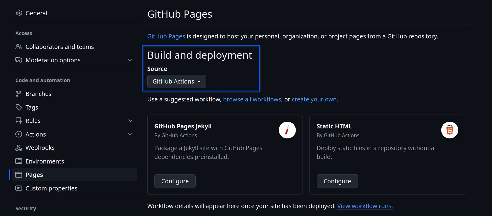
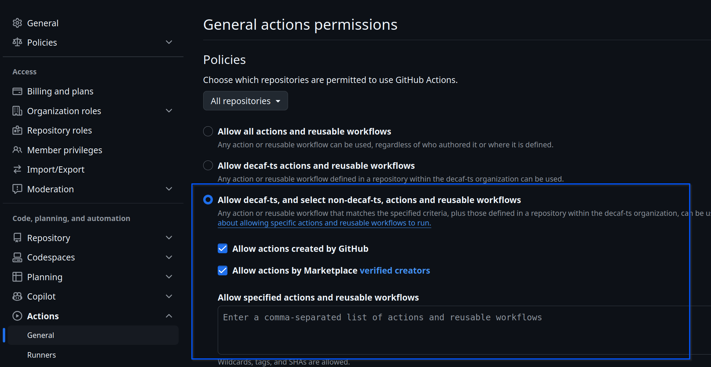
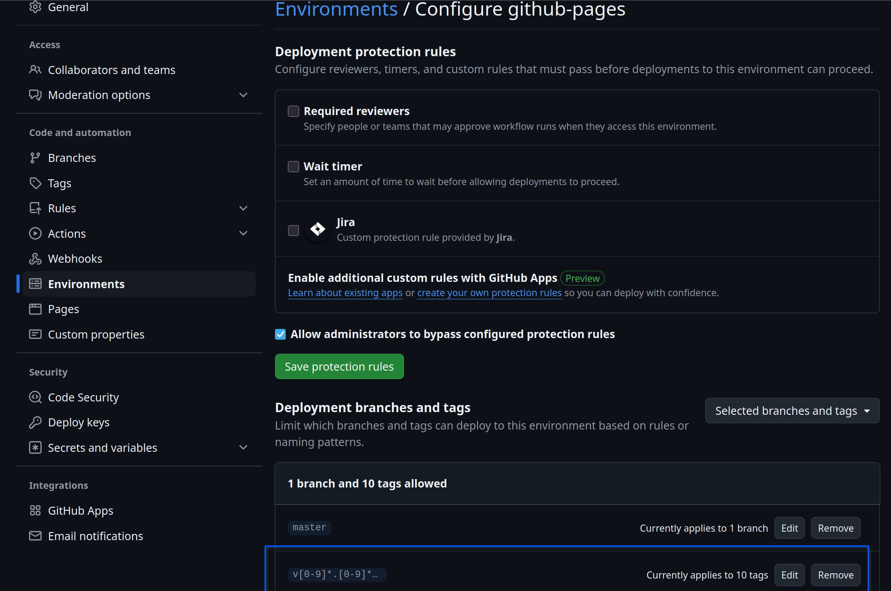

## **_Initial Setup_**

#### if you use GitHub

create a new project using this one as a template.

clone it `git clone <project>` and navigate to the root folder `cd <project>`

add a `.token` file containing your access token to the git repository (allows for git opts to work seamlessly).

run `npm run set-git-auth` to update your repo's git config to include the token

#### If your project has private dependencies or publishes to private npm registries, create an `.npmrc` containing:

```text
@<scope1>:registry=https://<ADDRESS>.com/api/v4/packages/npm/
@<scope2>:registry=https://<ADDRESS>.<DOMAIN>.com/api/v4/packages/npm/
//<ADDRESS>.<DOMAIN>.com/:_authToken=${TOKEN}
//<ADDRESS>.<DOMAIN>.com/api/v4/groups/<GROUP_ID>/packages/npm/:_authToken=${TOKEN}
//<ADDRESS>.<DOMAIN>.com/api/v4/projects/<PROJECT_ID>/packages/npm/:_authToken=${TOKEN}
```

Changing:

- <ADDRESS> to `gitlab` or `github` (or other);
- <DOMAIN> to your domain if any (if you are using plain gitlab or GitHub, remove "<DOMAIN>" and the extra dot);
- <GROUP_ID> to your project's group id (if any). otherwise remove this line
- <PROJECT_ID> to your project's id

### Installation

Run `npm install` (or `npm run do-install` if you have private dependencies and a `.token` file) to install the dependencies:

If this is the first time you are running this command, it will also (according to your choices:

- update this repository's dependencies to their latest version;
- creates the various token files which you can leave empty unless you have private dependencies or publish to private registries
- delete the `postinstall` script from `package.json`;
- try to commit the updated `package.json` and deleted files (having ssh access helps here);

### Scripts

The repository exposes the following npm scripts:

#### Setup and Maintenance

- `do-install` – reads the `.token` file into the `TOKEN` environment variable and runs `npm install`, which is handy when private registries require an auth token.
- `update-dependencies` – upgrades all dependencies that start with `@decaf-ts/` to their latest version.
- `update-scripts` – downloads the latest GitHub workflows, configs, and templates from the [ts-workspace](https://github.com/decaf-ts/ts-workspace) template repository.
- `sync-codex` – copies the prompts under `./.codex/prompts` into `~/.codex/prompts` so Codex CLI can reuse them.
- `on-first-run` – bootstraps the project by calling `update-scripts` with the `--boot` flag.
- `set-git-auth` – configures git remotes to use the token stored in `.token`; run this once per repository.
- `flash-forward` – bumps every dependency to the latest version via `npm-check-updates` and re-installs.
- `reset` – restores the repository to the state of the default branch (wipes the working tree and re-installs dependencies); use with care.

#### Build and Quality

- `build` – runs `npx build-scripts --dev` to produce development builds in `lib` and `dist`.
- `build:prod` – runs `npx build-scripts --prod` to generate optimized production builds.
- `lint` – executes ESLint across the repository.
- `lint-fix` – runs ESLint with `--fix` to automatically resolve issues when possible.
- `prepare-pr` – runs documentation, test, readme refresh, linting, production build, and coverage ahead of opening a pull request.

#### Repository AI Automation (via Codex)

- `repo:init` – launches the Codex repository initialization workflow for this project.
- `repo:setup` – runs the general setup Codex flow using the prompts in `.codex/prompts`.
- `repo:doc` – refreshes documentation via the Codex documentation prompts.
- `repo:tests` – generates or updates tests through the Codex testing flow.
- `repo:readme` – regenerates the README with the Codex readme prompt.
- `repo:pr` – sequentially executes `repo:doc`, `repo:tests`, and `repo:readme`.

#### Documentation Assets

- `drawings` – converts every Draw.io file under `workdocs/drawings` into PNG assets and copies them into `workdocs/resources`.
- `uml` – renders each PlantUML diagram found in `workdocs/uml` to PNG and copies the result to `workdocs/resources`.
- `docs` – clears the `docs` folder and rebuilds the static documentation site via `build-scripts --docs`.
- `publish-docs` – publishes the Markdown content under `workdocs/confluence` to Confluence through the official `markdown-confluence` container.

#### Docker

- `docker:login` – authenticates against `ghcr.io` using the credentials stored in `.dockeruser` and `.dockertoken`.
- `docker:build` – convenience alias that delegates to `docker:build-base`.
- `docker:build-base` – builds the base container image with BuildKit using the version from `package.json`.
- `docker:publish` – convenience alias that delegates to `docker:publish-base`.
- `docker:publish-base` – pushes the versioned and `latest` Docker images to the GHCR registry.

### Tests

All automated test scripts live in `package.json`:

- `test` – default entry point; forwards directly to `test:all`.
- `test:unit` – runs Jest against files in `tests/unit`.
- `test:integration` – runs Jest against files in `tests/integration`.
- `test:all` – executes the entire Jest test suite under `tests`.
- `test:dist` – runs the full suite twice, once against the compiled `lib` output and once against the `dist` bundle (via the `TEST_TARGET` environment variable).
- `test:circular` – checks the source for circular dependencies using `dpdm`.
- `coverage` – wipes previous coverage JSON files and runs the full test suite with the coverage-specific Jest config to emit reports and badges.

## Linting

This repo comes with eslint + prettier preconfigured to the default standards.

Please configure your IDE to recognize these files and perform automatic validation and fixes on save:
 - Webstorm:
   - eslint recommended setup preconfigured under `.idea/jsLinters/eslint.xml`
   - prettier recommended setup preconfigured under `.idea/prettier.xml`
 - VSCode(ium):
   - eslint recommended setup preconfigured under `.vscode/settings.json`
   - prettier recommended setup preconfigured under `.vscode/settings.json`

## Testing

Preconfigured Jest-based testing:

- `npm run test` – alias for `test:all`.
- `npm run test:unit` – executes unit tests under `tests/unit`.
- `npm run test:integration` – executes integration tests under `tests/integration`.
- `npm run test:dist` – re-runs the suite against the compiled `lib` and `dist` outputs.
- `npm run test:circular` – checks for circular dependencies.
- `npm run coverage` – stores coverage and test reports under `workdocs/reports`.
- Coverage and test results become part of the exported docs.
- Ignores `cli.ts` from coverage since that is an executable file.
- Uses `jest.config.ts` as the base config.
- Uses `workdocs/reports/jest.coverage.config.ts` for coverage-specific settings.
- Defines the coverage threshold in `workdocs/reports/jest.coverage.config.ts`.

## Documentation

The repository proposes a [way to generate documentation](./Documentation.md) that while still not ideal, produces very consistent results.

There are 3 steps in generating the documentation (automated in CI):

- `npm run drawings` - generates png files from each drawing in the `workdocs/drawings` folder and moves them to the `workdocs/resources` folder (requires Docker);
- `npm run uml` - generates png files from each PlantUML diagram in the `workdocs/uml` folder and moves them to the `workdocs/resources` folder (requires Docker);
- `npm run docs` - (should be ran after `npm run coverage` to include test results and coverage) this has several stages, defined under the `npx build-docs`):
  - compiles the Readme file via md compile:
    - enables keeping separate files for sections that are then joined into a single file;
    - Allows keeping specific files in the jsdoc tutorial folder so they show up on their own menu;
  - compiles the documentation from the source code using jsdoc:
    - uses the better docs template with the category and component plugins
    - uses the mermaid jsdoc plugin to imbue uml diagrams in the docs
    - includes a nav link to the test coverage results;
  - copies the jsdoc and mds to `/docs`;
  - copies the `./workdocs/{drawings, uml, assets, resources}` to `./docs`;

The produced `docs` folder contains the resulting documentation;

## Continuous Integration/Deployment

While the implementation for gitlab and GitHub are not perfectly matched, they are perfectly usable.

The template comes with ci/cd for :

- gitlab (with caching for performance):
  - stages:
    - dependencies: Installs dependencies (on `package-lock.json` changes, caches node modules);
    - build: builds the code (on `src/*` changes, caches `lib` and `dist`);
    - test: tests the code (on `src/*`, `test/*` changes, caches `workdocs/{resources, badges, coverage}`);
    - deploy:
      - deploys to package registry on a tag (public|private);
      - deploys docker image to docker registry (private);
      - Deploys the documentation to the repository pages;
- github:
  - jest-test: standard `install -> build -> test` loop;
  - jest-coverage: extracts coverage from the tests;
  - codeql-analysis: Code quality analysis;
  - snyk-scan: Vulnerability scanning
  - pages: builds the documentation and deploys to GitHub pages
  - release-on-tag: issues a release when the tag does not contain `-no-ci` string
  - publish-on-release: publishes to package registry (following the release) when the tag does not contain the `-no-ci` string
  - Requires Variables:
    - CONSECUTIVE_ACTION_TRIGGER: secret to enable actions to trigger other actions;
    - NPM_TOKEN: npm registry token
  - CI Pages Setup:
    - Enable Pages via a GitHub action: 
    - Secure Workflows via GitHub action: 
    - Allow GitHub pages via GitHub action for tags: 

### Releases

This repository automates releases in the following manner:

- run `./bin/tag-release.sh <version> <message>` (arguments are optional):
  - if arguments are missing, you will be prompted for them;
- it will run `npm run prepare-pr` to ensure documentation, tests, and coverage are up to date;
- it will commit all changes if needed;
- it will create and push the new tag through `npm version`;

If publishing to a private repo's npm registry, make sure you add to your `package.json`:

```json
{
  "publishConfig": {
    "<SCOPE>:registry": " https://<REGISTRY>/api/v4/projects/<PROJECT_ID>/packages/npm/"
  }
}
```

Where:

- `<SCOPE>` - Is the scope of your package;
- `<REGISTRY>` - your registry host;
- `<PROJECT_ID>` - you project ID number (easy to grab via UI in gitlab or by
  running `$("meta[name=octolytics-dimension-repository_id]").getAttribute('content')` in the repository page in github);

### Publishing

Unless the `-no-ci` flag is passed in the commit message when running `./bin/tag-release.sh`, publishing will be handled
automatically by github/gitlab (triggered by the tag).

When the `-no-ci` flag is passed then you can:

- run `npm publish`. This command assumes :
  - you have previously run the release script and tagged the repository;
  - you have you publishing properly configured in `npmrc` and `package.json`;
  - The token for any special access required is stored in the `.token` file;

### AI

#### codex
This repository comes prebuilt with codex support. It will use the prompts and configurations in the `.codex` folder to provide AI assistance.
To sync its prompts, run the `npm run sync-codex` command.
Prompts under `./.codex/prompts` are:
- `update-readme.md` - will update the readme file with a summary, detailed description, and examples of use for all identified elements in the code and tests;
- `bulk-tests.md` - will create tests until a certain coverage is reached;
- `repo-setup.md` - will ensure the repository is properly setup with correct badges, scripts, and documentation;
- `update-dependencies.md` - will update all dependencies to their latest versions, taking care of any breaking changes;
- `doc.md` - will setup a documentation role;
- `file.md` - will document the file;
- `bulk-docs.md` - will document all files in the `src` folder;

`AGENTS.md` can also be found in the `.codex` folder, describing how to use agents with this repository.

### Repository Structure

```
repository-root
│
│   .confluence-token               <-- stores confluence access token
│   .dockerignore                   <-- Defines files by docker in the build image
│   .dockeruser                     <-- stores docker registry user
│   .dockertoken                    <-- stores docker registry access token
│   .gitignore                      <-- Defines files ignored to git
│   .gitlab-ci.yml                  <-- CI behaviour for gitlab
│   .npmignore                      <-- Defines files ignored by npm
│   .nmprc                          <-- Defines the Npm registry for this package
│   .nmptoken                       <-- Defines access token for the Npm registry for this package
│   .prettierrc                     <-- style definitions for the project
│   .snyk                           <-- vulnerability scan (via snyk) config
│   .token                          <-- token for dependencies in private registries
│   .eslint.config.js               <-- linting for the project
│   jest.config.ts                  <-- Tests Configuration file
│   LICENCE.md                      <-- Licence disclamer
│   package.json
│   package-lock.json
│   README.md                       <-- Readme File dynamically compiled from 'workdocs' via the 'docs' npm script
│   tsconfig.json                   <-- Typescript config file.
│
└───.codex
│   │   ...                         <-- codex prompts and configs
│
└───.github
│   │   ...                         <-- github workflows and templates
│
└───.idea
│   │   ...                         <-- IDE run scripts for Jetbrains IDEs
│
│└───.vscode
│   │   ...                         <-- IDE run scripts and configs for VSCode(ium)
│
└───bin
│   │───tag_release.sh             <-- Script to help with releases
│   └───sync-codex.sh              <-- Script to update codex prompts from reporitory ones
└───dist
│   │   ...                         <-- Dinamically generated folder containing the bundles for distribution
│
└───docs
│   │   ...                         <-- Dinamically generated folder, containing the compiled documentation for this repository. generated via the 'docs' npm script
│
└───lib
│   |   ...                         <-- Dinamically generated folder containing the compiled code
│
└───src
│   │   ...                         <-- Source code for this repository
│
└───tests
│   │───bundling                    <-- Tests the result of the produced bundle
│   │───unit                        <-- Unit tests
│   └───integration                 <-- Integration tests
│
└───workdocs                        <-- Folder with all pre-compiled documentation
    │───assets                      <-- Documentation asset folder
    │───confluence                  <-- folder containing specific documentation to be synced with a confluence page
    │───drawings                    <-- Drawio drawings that are converted to the resources folder dynamically
    │───reports                     <-- Folder storing generated content (compiled uml, drawio, test reports, etc)
    │   └───coverage                <-- Auto generated coverage results (report ready html)
    │   └───data                    <-- folder used as temp while genrating reports wiht attachements
    │   └───html                    <-- test results (jest-html-reporters) complete test report with attachements
    │   └───junit                   <-- test results (junit xml)
    │   └───jest.coverage.config.ts <-- jest config collecting coverage and exporting test results (extends base config)
    │───resources                   <-- Folder storing generated content (compiled uml, drawio, etc)
    │───tutorials                   <-- Tutorial folder (will show up on tutorial section in generated documentation)
    │───uml                         <-- folder containing puml files to be compiled along with the documentation
    │   ...                         <-- Categorized *.md files that are merged to generate the final readme (via md compile)
    │   jsdocs.json                 <-- jsdoc Documentation generation configuration file
    │   Readme.md                   <-- Entry point to the README.md (will import other referenced md files)
    │   readme-md.json              <-- md Documentation generation configuration file for the README.md file
```

## IDE Integrations

### Visual Studio Code (VSCode)

For an optimal development experience in **VSCode**, we recommend installing the following extensions:

- [ESLint](https://marketplace.visualstudio.com/items?itemName=dbaeumer.vscode-eslint) – Linting made easy and integrated.
- [Prettier](https://marketplace.visualstudio.com/items?itemName=esbenp.prettier-vscode) – Code formatting with style.
- [Jest](https://marketplace.visualstudio.com/items?itemName=Orta.vscode-jest) – Smooth integration for running and debugging tests.

We've included a pre-configured `settings.json` that ensures:

- **Linting and formatting** are automatically applied on file save.
- **Jest** works seamlessly with your test suite out of the box.

#### Tasks & Launchers

Common tasks like `build`, `test`, and others are pre-configured as **VSCode Tasks** and **Launch Configurations**.

To access and run them:

- Open the Command Palette (`Cmd/Ctrl + Shift + P`) and select `Tasks: Run Task`.
- Or go to the **Run and Debug** panel, choose a configuration from the dropdown, and press ▶️.

---

### WebStorm

For **WebStorm** users, everything comes integrated right out of the box 🎉  
Common commands for builds, tests, and documentation generation are available in the **Run/Debug configurations** dropdown for quick access and execution via:

 - Jest integration:
   - `tests/Unit Tests` - Runs all unit tests (analog to `test:unit`)
   - `tests/Integration Tests` - Runs all integration tests (analog to `test:integration`)
   - `tests/Bundling Tests` - Runs the dist checks for compiled artifacts (analog to `test:dist`)
   - `All Tests` - Runs all tests (analog to `test:all`)

 - Node integration:
   - `repo/docs` - Builds documentation (analog to `docs`)
   - `repo/coverage` - runs `test:all`, collects coverage (csv, HTML), generates test reports (junit, HTML) (analog to `coverage`)
   - `repo/uml` - builds uml into png files (analog to `uml`)
   - `repo/test:circular` - test code for circular dependencies (analog to `test:circular`)
   - `repo/lint-fix` - tries to fix linting issues (analog to `lint-fix`)
   - `repo/drawings` - compiles draw.io files to png (one per page) (analog to `drawings`)
   - `repo/flash-forward` - updates all dependencies to latest versions (analog to `flash-forward`)
  - `repo/update-scripts` - runs cli to update repo's configs (CI, Doc boilerplate, Linting, Style, etc) via its template repository (analog to `update-scripts`)
   - `build:prod` - `build`s code in production mode (minify, uglify, doc extraction, and no source-map for bundled production)
   - `build` - `build`s code in development mode

## Considerations

- Setup for node 22, but will work at least with 16;
- Requires docker to build documentation (drawings and PlantUML)
